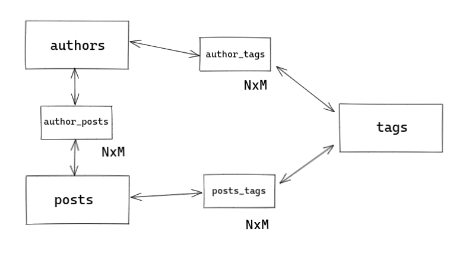

# Blogo

## About

Blogo is a toy project. It helped me to learn and apply graphql tools and concepts.
The project models three related entities: Authors, Posts and Tags of a blog website.

The database diagram can be checked below:



An author wrote many posts and can be classified by many tags. Moreover a post could be written by many authors and also be classified by many tags. So all the relations are `NxM`.

That is a interesting situation to work with graphql because it allows the consumer to write a query choosing which fields and relations should be loaded.

## Querying

You can find an author and all its posts along with its tags:

```graphql
  query{
    author(id: "856ffaaa-bde4-45fa-8907-508aaf34e465"){
      id
      name
      age
      country
      insertedAt
      posts{
        id
        title
        views
        insertedAt
        tags{
          name
        }
      }
    }
  }
```
resulting:

```json
  {
    "data": {
      "author": {
        "age": 70,
        "country": "EUA",
        "id": "856ffaaa-bde4-45fa-8907-508aaf34e465",
        "insertedAt": "2022-11-06T20:03:58Z",
        "name": "Bill Bryson",
        "posts": [
          {
            "id": "8334c62b-c564-449c-8123-05614acb139d",
            "insertedAt": "2022-11-06T20:03:58Z",
            "tags": [
              {
                "name": "estrangeiro"
              },
              {
                "name": "nao_ficcao"
              }
            ],
            "title": "Breve Historia de quase tudo",
            "views": 23
          }
        ]
      }
    }
  }
```

Or you can find all the authors and posts related to a tag:

```graphql
  query{
    tag(id: "4f0697c9-1933-4c33-a759-d5ad0b9268dd"){
      id
      name
      posts{
        id
        title
      }
      authors{
        id
        name
      }
    }
  }
```

resulting:

```json
  {
    "data": {
      "tag": {
        "authors": [
          {
            "id": "b628218d-ba7f-4a02-9dd6-1c1a61a21df9",
            "name": "Felipe Castilho"
          },
          {
            "id": "32986637-d20d-4017-a825-a57f14277fc3",
            "name": "Clarice Lispector"
          }
        ],
        "id": "4f0697c9-1933-4c33-a759-d5ad0b9268dd",
        "name": "ficcao",
        "posts": [
          {
            "id": "95f16281-895b-4c87-b886-bccbd17d9e1f",
            "title": "A hora da estrela"
          },
          {
            "id": "d86f73f4-c3dd-4530-8c1e-f793cac22341",
            "title": "Felicidade Clandestina"
          },
          {
            "id": "314d2808-5216-4485-961a-8bd95da2dcef",
            "title": "O Legado do Folclore"
          },
          {
            "id": "61ca7379-0ee9-48c2-b704-fb31cc7e5c3e",
            "title": "Serpentario"
          }
        ]
      }
    }
  }
```

Besides the possibility to choose fields and relations, it is also possible to apply query filtering params on them.
The below query brings three tags sorted by `name asc` and all its authors where some of the text fields matches with `"brasil"`:

```graphql
  query{
    tags(queryParams:{
      limit: 3,
      sortBy: [{field: NAME, order: ASC}],
    }){
      name
      authors(queryParams:{
        filters: {textSearch: "brasil"}
      }){
      name
      age
      country
      }
    }
  }
```

resulting:

```json
  {
    "data": {
      "tags": [
        {
          "authors": [],
          "name": "estrangeiro"
        },
        {
          "authors": [
            {
              "age": 36,
              "country": "Brasil",
              "name": "Felipe Castilho"
            }
          ],
          "name": "fantasia"
        },
        {
          "authors": [
            {
              "age": 36,
              "country": "Brasil",
              "name": "Felipe Castilho"
            },
            {
              "age": 57,
              "country": "Brasil",
              "name": "Clarice Lispector"
            }
          ],
          "name": "ficcao"
        }
      ]
    }
  }
```

## Performance Security

Since graphql APIs allows the consumer to choose fields and relations, it is prudent to the backend to implement some limits.
The Blogo project implents complexity limit and depth limit. A query could not ask for more than 25 fields and cannot have a depth level above 5.

Even though dataloader helps us reducing database round trips, this kind of approach prevents heavy load queries to be executed.

## Starting the project

To start your Phoenix server:

  * Install dependencies with `mix deps.get`
  * Create and migrate your database with `mix ecto.setup`
  * Start Phoenix endpoint with `mix phx.server` or inside IEx with `iex -S mix phx.server`

Now you can visit [`localhost:4000/graphiql`](http://localhost:4000/graphiql) from your browser and start querying.


## Special thanks and references

During the implementation I fould really good texts and tutorials that helped me a lot:

  * Bruce Williams and Ben Wilson: [Craft GraphQL APIs in Elixir with Absinthe](https://pragprog.com/titles/wwgraphql/craft-graphql-apis-in-elixir-with-absinthe/)
  * Sheharyar Naseer: [Error standardization](https://shyr.io/blog/absinthe-exception-error-handling)
  * Marcos Tapajós: [Absinthe Graphql nested queries security](https://stackoverflow.com/a/53437633)
  * Absinthe docs on hex: [Custom Scalar Types](https://hexdocs.pm/absinthe/custom-scalars.html)
  * Absinthe docs on hex: [Complexity security](https://hexdocs.pm/absinthe/Absinthe.Schema.Notation.html#complexity/1)
